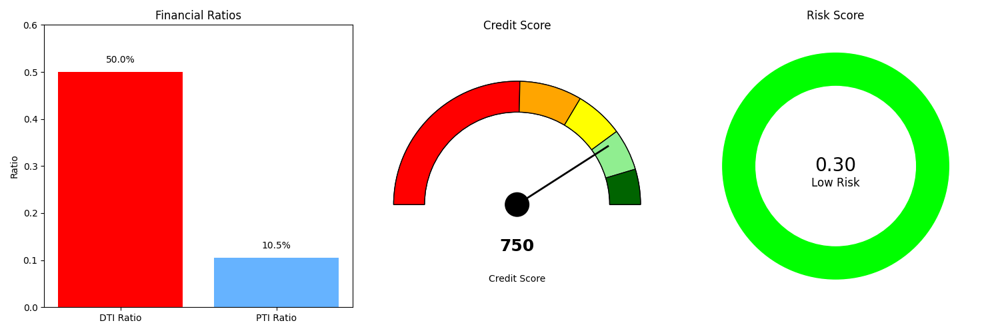

# Multi-Agent Loan Processing System

## Project Overview

This Kaggle notebook demonstrates a sophisticated multi-agent AI system that simulates the end-to-end processing of loan applications. Using Google's Gemini model, the system showcases advanced capabilities in document processing, information extraction, verification, credit assessment, and automated underwriting through a team of specialized AI agents working together.



## Key Features

- **Document Processing**: Handles PDF application forms, image-based ID documents, and text financial statements
- **Information Extraction**: Pulls structured data from diverse document formats
- **Verification Processes**: Simulates KYC/AML checks and validates document consistency
- **Credit Assessment**: Analyzes credit reports and calculates risk scores based on comprehensive financial metrics
- **Automated Underwriting**: Uses Retrieval Augmented Generation (RAG) to apply lending policies to loan applications
- **Decision Support**: Provides detailed, justified loan recommendations with supporting evidence
- **Batch Processing**: Processes multiple loan applications and generates comparative reports
- **Interactive Interface**: User-friendly interface for running the system in different modes

## System Architecture

The system consists of six specialized AI agents:

1. **IntakeAgent**: Validates and processes incoming loan documents
2. **ExtractionAgent**: Extracts structured data from various document types
3. **VerificationAgent**: Performs simulated KYC/AML checks and document validation
4. **CreditAssessmentAgent**: Analyzes credit risk based on financial data
5. **UnderwritingAgent**: Applies lending policies using RAG to make lending decisions
6. **ReportingAgent**: Generates comprehensive loan summary reports with visualizations

## Technologies Demonstrated

- **Large Language Models**: Uses Google's Gemini model for sophisticated reasoning
- **Document AI**: Extracts structured information from unstructured documents
- **Function Calling**: Simulates interactions with external systems
- **Retrieval Augmented Generation (RAG)**: Applies lending policies using vector search
- **Vector Embeddings**: Creates semantic representations of lending policies
- **Data Visualization**: Generates interactive charts of key financial metrics
- **Error Handling**: Implements robust parsing and error recovery mechanisms
- **Mock Data Generation**: Creates realistic synthetic loan application documents

## Data Science Skills Showcased

- **Data Extraction & Transformation**: Converting unstructured documents to structured data
- **Financial Ratio Analysis**: Calculating DTI, PTI, and LTV ratios
- **Risk Modeling**: Creating comprehensive risk assessment algorithms
- **Data Visualization**: Building informative metric visualizations
- **System Architecture Design**: Designing a complex multi-agent system
- **Domain Expertise**: Applying financial industry knowledge to lending decisions
- **AI Orchestration**: Coordinating multiple specialized agents in a workflow
- **Error Handling**: Implementing robust error recovery mechanisms

## Getting Started

### Prerequisites

- Python 3.9+
- Google API key for Gemini access
- Required libraries (see requirements section in notebook)

### Installation

1. Clone this repository or open in Kaggle
2. Install the required packages:
```python
!pip install -q google-generativeai langchain pypdf pillow sentence-transformers faiss-cpu python-dotenv dataclasses-json pydantic typing ipywidgets matplotlib
```
3. Set up your Google API credentials in a `.env` file or Kaggle secrets

### Running the Demo

Execute the notebook cells sequentially to:
1. Set up the environment and suppress TensorFlow warnings
2. Define the data structures and agent classes
3. Generate mock loan application documents
4. Launch the interactive interface with the following options:
   - **Use Mock Data**: Process a single mock application with detailed reporting
   - **Batch Processing**: Process multiple applications with comparative analysis

## Sample Output

The system generates comprehensive loan processing reports that include:
- Applicant information summary
- Loan request details
- Key financial metrics with visualizations
- Verification summary
- Credit assessment with risk factors
- Underwriting decision with justification
- Recommended action for loan officers

## Project Structure

```
loan_processing_notebook/
├── mock_data/                      # Mock application documents
│   ├── loan_application_{i}.pdf    # Application forms
│   ├── id_document_{i}.png         # ID documents
│   ├── financial_statement_{i}.txt # Financial statements
│   └── credit_report_{i}.json      # Credit reports
├── lending_policies.json           # Mock lending policies
├── loan_processing_report.html     # Default report for single application
└── loan_report_{i}.html            # Generated reports for batch processing
```

## Implementation Details

### Multi-Agent System
The project implements a complete multi-agent system where each agent is specialized for a specific task in the loan processing pipeline. The agents communicate through well-defined interfaces, passing structured data between processing stages.

### Mock Data Generation
The system includes sophisticated mock data generation capabilities to create realistic loan application documents including:
- PDF application forms with applicant information
- ID document images with personal identification
- Financial statements with detailed financial metrics
- Credit reports with credit history and scores

### RAG-Based Underwriting
The underwriting process uses Retrieval Augmented Generation to apply lending policies. This involves:
1. Creating vector embeddings of lending policies
2. Retrieving relevant policies based on application details
3. Applying these policies to make informed lending decisions

### Visualization
The system generates detailed visualizations including:
- Credit score gauges with colored segments
- Financial ratio comparisons
- Risk factor analysis charts

## Contact

For questions or feedback about this project, please contact [LinkedIn](https://www.linkedin.com/in/ibrahima2barry)